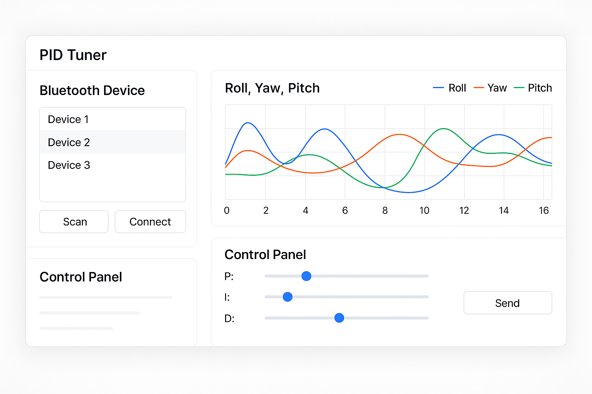

# 🚀 PIDLab - 실시간 BLE 기반 PID 튜너 GUI



## 🧭 소개

**PIDLab**은 Bluetooth Low Energy(BLE) 기반의 임베디드 장치(STM32 등)와 통신하여  
실시간으로 **센서 데이터를 시각화**하고 **PID 게인(P, I, D)**을 조정할 수 있는 **GUI 애플리케이션**입니다.  

사용자는 슬라이더 또는 직접 입력을 통해 PID 값을 조정하고,  
변경된 값은 BLE를 통해 임베디드 장치에 전송됩니다.  
센서 데이터는 실시간 그래프로 표시되어 튜닝 효과를 즉시 확인할 수 있습니다.


## 🧩 주요 기능

- ✅ BLE 스캔 및 연결 (BLE 장치 자동 검색)
- ✅ JSON 기반 데이터 전송/수신
- ✅ PySide6 기반 GUI, PyQtGraph 그래프 시각화
- ✅ P / I / D 슬라이더 및 수치 입력
- ✅ 실시간 센서 그래프 (Roll, Pitch, Yaw, Accel, Temp 등)
- ✅ 선택한 항목만 시각화 (체크박스)
- ✅ 직관적인 UI 디자인과 커스터마이징 가능한 스타일 시트


## 📂 프로젝트 구조

```
ble_pid_tuner/
├── main.py                      # 앱 진입점
├── config/
│   └── constants.py             # UUID, 전송 포맷, 기본 설정값
├── ble/
│   └── ble_client.py            # BLE 통신 클래스 (scan, connect, notify, send)
├── core/
│   ├── pid_controller.py        # (선택) 향후 PID 시뮬레이터 혹은 모델화 가능
│   └── parser.py                # JSON 프레임 파싱, 전처리기 등
├── gui/
│   ├── main_window.py           # 메인 GUI 윈도우
│   ├── widgets/
│   │   ├── device_selector.py   # BLE 장치 선택 위젯
│   │   └── pid_panel.py         # PID 슬라이더/입력 UI
│   └── plots/
│       └── realtime_plot.py     # 실시간 그래프 UI 처리
├── utils/
│   └── logger.py                # 로그 출력 또는 파일 저장 모듈
├── tests/
│   └── ble_test.py 
└── resources/
    └── icons/, ui.ui, styles/   # UI 리소스, 스타일시트
```

## UI 구성
좌측 패널: BLE 장치 검색 / 연결, 체크박스(센서 데이터 선택)

우측 상단: PyQtGraph를 활용한 실시간 그래프

우측 하단: PID 제어 슬라이더 및 수치 입력창 + 전송 버튼
